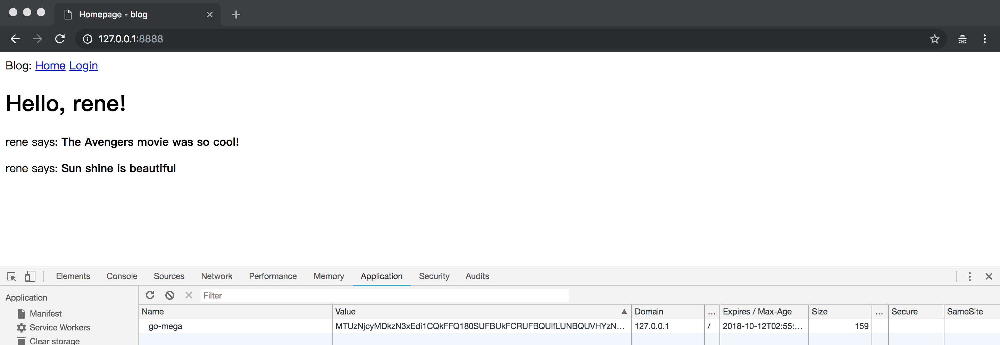
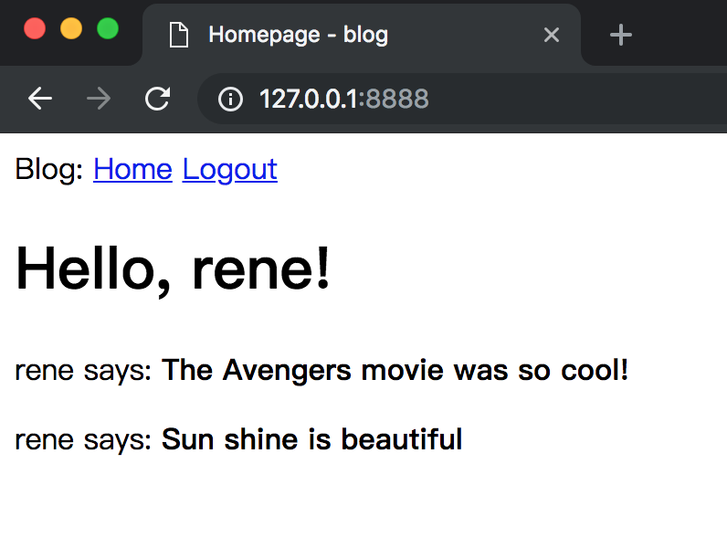
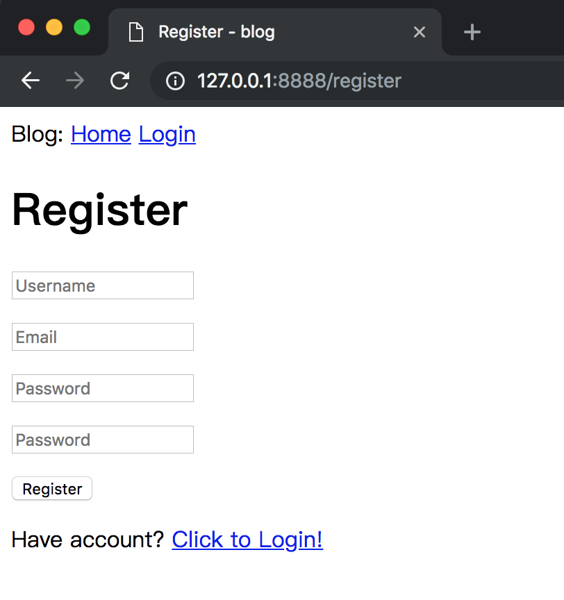

# 06-User Login

这章我将告诉你如何创建一个用户登录子系统。

你在[第四章](04-web-form.md)中学会了如何创建用户登录表单，在[第五章](05-database.md)中学会了运用数据库。本章将教你如何结合这两章的主题来创建一个简单的用户登录系统。


_本章的GitHub链接为：_ [Source](https://github.com/bonfy/go-mega-code/tree/06-User-Login), [Diff](https://github.com/bonfy/go-mega-code/compare/05-Database...06-User-Login), 
[Zip](https://github.com/bonfy/go-mega-code/archive/v0.6.zip)

## Session

不知道 **Go** 有没有第三方库实现类似 Flask-Login 这样的登陆辅助(我也没有好好去找)，不过我们知道原理，基本上就是用 Session 实现的，对 Session 不了解的同学可以看下 [Session and Cookie](https://github.com/astaxie/build-web-application-with-golang/blob/master/zh/06.1.md)

这里我们又要引入一个第三方package来实现这个Session(如果不引入第三方库，自己处理还满麻烦的，所以就选择easy way)

```cmd
$ go get -v github.com/gorilla/sessions
```

#### 全局变量设置


在 controller/g.go 中设置将要用到的全局变量 `sessionName`, `store`, 

> Tip: 设置全局变量其实是方便以后的更新，如果以后sessionName要改成 `flask-mega`,只要跑到全局设置的地方修改，不用到每个函数中修改，而且还容易改错。

store 初始化的时候可以设置 secret-key，这里直接 hard code 了，其实安全点的做法可以设置在配置文件里,这里就这样偷懒了吧

controller/g.go
```go
package controller

import (
    "html/template"

    "github.com/gorilla/sessions"
)

var (
    homeController home
    templates      map[string]*template.Template
    sessionName    string
    store          *sessions.CookieStore
)

func init() {
    templates = PopulateTemplates()
    store = sessions.NewCookieStore([]byte("something-very-secret"))
    sessionName = "go-mega"
}

// Startup func
func Startup() {
    homeController.registerRoutes()
}
```


#### 将 session 操作封装

操作函数基本上就是  `GetSession`, `SetSession`, `ClearSession` 所有语言说道Session基本上就实现这三个基本的，后面属于自由发挥

controller/utils.go
```go
...

// session

func getSessionUser(r *http.Request) (string, error) {
    var username string
    session, err := store.Get(r, sessionName)
    if err != nil {
        return "", err
    }

    val := session.Values["user"]
    fmt.Println("val:", val)
    username, ok := val.(string)
    if !ok {
        return "", errors.New("can not get session user")
    }
    fmt.Println("username:", username)
    return username, nil
}

func setSessionUser(w http.ResponseWriter, r *http.Request, username string) error {
    session, err := store.Get(r, sessionName)
    if err != nil {
        return err
    }
    session.Values["user"] = username
    err = session.Save(r, w)
    if err != nil {
        return err
    }
    return nil
}

func clearSession(w http.ResponseWriter, r *http.Request) error {
    session, err := store.Get(r, sessionName)
    if err != nil {
        return err
    }

    session.Options.MaxAge = -1

    err = session.Save(r, w)
    if err != nil {
        return err
    }

    return nil
}
```

> Tip: 这里 clearSession 的操作是通过设置 MaxAge 为 负数来完成的。

#### ListenAndServe 修改

main.go

```go
    ...
    controller.Startup()

    http.ListenAndServe(":8888", context.ClearHandler(http.DefaultServeMux))
```

这样我们就支持了 session 我们在 controller home中来使用


vm/login.go

```go
...

// CheckLogin func
func CheckLogin(username, password string) bool {
    user, err := model.GetUserByUsername(username)
    if err != nil {
        log.Println("Can not find username: ", username)
        log.Println("Error:", err)
        return false
    }
    return user.CheckPassword(password)
}
```


controller/home.go
```go
...

func (h home) registerRoutes() {
    http.HandleFunc("/", indexHandler)
    http.HandleFunc("/login", loginHandler)
    http.HandleFunc("/logout", logoutHandler)
}

...

func loginHandler(w http.ResponseWriter, r *http.Request) {
    ...

        if !vm.CheckLogin(username, password) {
            v.AddError("username password not correct, please input again")
        }

        if len(v.Errs) > 0 {
            templates[tpName].Execute(w, &v)
        } else {
            setSessionUser(w, r, username)
            http.Redirect(w, r, "/", http.StatusSeeOther)
        }
    }
}

func logoutHandler(w http.ResponseWriter, r *http.Request) {
    clearSession(w, r)
    http.Redirect(w, r, "/login", http.StatusTemporaryRedirect)
}
```

上面的代码完成了在 login 成功后设置 session，也加入了 logoutHanler

现在我们运行程序后，点击login 之后会发现，session `go-mega`



> 本小节 [Diff](https://github.com/bonfy/go-mega-code/commit/6f54950b8a6faa86a648f05978e3eab6877343ee)

## middleware实现登陆控制

一般正常的需要登陆的网站，如果你要访问主页面，如果你没有登陆过，跳转到登陆界面，如果之前登陆过，则直接跳转到你要访问的页面。

现在我们访问根目录`http://127.0.0.1/`是不受登陆控制的，如果我们要给它加上必须登陆后才能访问，要怎么处理呢？

答案就是加上 middleware 中间层去判断是否存在session，类似于 Python 中的装饰器的作用

controller/middle.go

```go
package controller

import (
    "log"
    "net/http"
)

func middleAuth(next http.HandlerFunc) http.HandlerFunc {
    return func(w http.ResponseWriter, r *http.Request) {
        username, err := getSessionUser(r)
        log.Println("middle:", username)
        if err != nil {
            log.Println("middle get session err and redirect to login")
            http.Redirect(w, r, "/login", http.StatusTemporaryRedirect)
        } else {
            next.ServeHTTP(w, r)
        }
    }
}
```

在路由上加入session 控制

```go
...
func (h home) registerRoutes() {
    http.HandleFunc("/", middleAuth(indexHandler))
    http.HandleFunc("/login", loginHandler)
    http.HandleFunc("/logout", middleAuth(logoutHandler))
}

func indexHandler(w http.ResponseWriter, r *http.Request) {
    tpName := "index.html"
    vop := vm.IndexViewModelOp{}
    username, _ := getSessionUser(r)
    v := vop.GetVM(username)
    templates[tpName].Execute(w, &v)
}
...
```

现在我们访问到 indexHandler 的时候 middleAuth 保证是有session的，所以取出session，根据取出的user来获取viewmodel响应的，我们的 vm 也要调整

主要是将 User区分下，比如 `CurrentUser` 以后就代表登陆的用户，也就是Session的User，例如`ProfileUser` 则可以是你查看的任何人

vm/g.go

```go
package vm

// BaseViewModel struct
type BaseViewModel struct {
    Title       string
    CurrentUser string
}

// SetTitle func
func (v *BaseViewModel) SetTitle(title string) {
    v.Title = title
}

// SetCurrentUser func
func (v *BaseViewModel) SetCurrentUser(username string) {
    v.CurrentUser = username
}
```

vm/index.go

```go
...
// GetVM func
func (IndexViewModelOp) GetVM(username string) IndexViewModel {
    u1, _ := model.GetUserByUsername(username)
    posts, _ := model.GetPostsByUserID(u1.ID)
    v := IndexViewModel{BaseViewModel{Title: "Homepage"}, *posts}
    v.SetCurrentUser(username)
    return v
}
```

templates/\_base.html

```html
    ...
        <div>
            Blog: 
            <a href="/">Home</a>
            {{if .CurrentUser}}
            <a href="/logout">Logout</a>
            {{else}}
            <a href="/login">Login</a>
            {{end}}
        </div>
    ...
```

templates/content/index.html

```html
{{define "content"}}
    <h1>Hello, {{.CurrentUser}}!</h1>

    {{range .Posts}}
        <div><p>{{ .User.Username }} says: <b>{{ .Body }}</b></p></div>
    {{end}}
{{end}}
```

然后运行，输入 `http://127.0.0.1/` 会直接跳转到登陆页面；在正确输入用户名、密码正确登陆后，右上角变成了 `Logout`



> 本小节 [Diff](https://github.com/bonfy/go-mega-code/commit/4ce33f3dbdd4ebb828edcb553caa4e32e9bf0318)

## 加入register

templates/content/register.html

```html
{{define "content"}}
    <h1>Register</h1>
    <form action="/register" method="post" name="register">
        <p><input type="text" name="username" value="" placeholder="Username"></p>
        <p><input type="text" name="email" value="" placeholder="Email"></p>
        <p><input type="password" name="pwd1" value="" placeholder="Password"></p>
        <p><input type="password" name="pwd2" value="" placeholder="Password"></p>
        <p><input type="submit" name="submit" value="Register"></p>
    </form>

    <p>Have account? <a href="/login">Click to Login!</a></p>

    {{if .Errs}}
    <ul>
        {{range .Errs}}
            <li>{{.}}</li>
         {{end}}
    </ul>
    {{end}}
{{end}}
```

在 login 的页面上加入 `register` 链接

templates/content/login.html

```html
...
 <p>New User? <a href="/register">Click to Register!</a></p>
...
```

addUser 的调用是 vm调用model的，controller 调用 vm的，所以各层都要建立 AddUser函数

model/user.go

```go
...
// AddUser func
func AddUser(username, password, email string) error {
    user := User{Username: username, Email: email}
    user.SetPassword(password)
    return db.Create(&user).Error
}
```

vm/register.go

```go
package vm

import (
    "log"

    "github.com/bonfy/go-mega-code/model"
)

// RegisterViewModel struct
type RegisterViewModel struct {
    LoginViewModel
}

// RegisterViewModelOp struct
type RegisterViewModelOp struct{}

// GetVM func
func (RegisterViewModelOp) GetVM() RegisterViewModel {
    v := RegisterViewModel{}
    v.SetTitle("Register")
    return v
}

// CheckUserExist func
func CheckUserExist(username string) bool {
    _, err := model.GetUserByUsername(username)
    if err != nil {
        log.Println("Can not find username: ", username)
        return true
    }
    return false
}

// AddUser func
func AddUser(username, password, email string) error {
    return model.AddUser(username, password, email)
}
```

controller/utils.go

```go
...
// Login Check
func checkLen(fieldName, fieldValue string, minLen, maxLen int) string {
    lenField := len(fieldValue)
    if lenField < minLen {
        return fmt.Sprintf("%s field is too short, less than %d", fieldName, minLen)
    }
    if lenField > maxLen {
        return fmt.Sprintf("%s field is too long, more than %d", fieldName, maxLen)
    }
    return ""
}

func checkUsername(username string) string {
    return checkLen("Username", username, 3, 20)
}

func checkPassword(password string) string {
    return checkLen("Password", password, 6, 50)
}

func checkEmail(email string) string {
    if m, _ := regexp.MatchString(`^([\w\.\_]{2,10})@(\w{1,}).([a-z]{2,4})$`, email); !m {
        return fmt.Sprintf("Email field not a valid email")
    }
    return ""
}

func checkUserPassword(username, password string) string {
    if !vm.CheckLogin(username, password) {
        return fmt.Sprintf("Username and password is not correct.")
    }
    return ""
}

func checkUserExist(username string) string {
    if !vm.CheckUserExist(username) {
        return fmt.Sprintf("Username already exist, please choose another username")
    }
    return ""
}

// checkLogin()
func checkLogin(username, password string) []string {
    var errs []string
    if errCheck := checkUsername(username); len(errCheck) > 0 {
        errs = append(errs, errCheck)
    }
    if errCheck := checkPassword(password); len(errCheck) > 0 {
        errs = append(errs, errCheck)
    }
    if errCheck := checkUserPassword(username, password); len(errCheck) > 0 {
        errs = append(errs, errCheck)
    }
    return errs
}

// checkRegister()
func checkRegister(username, email, pwd1, pwd2 string) []string {
    var errs []string
    if pwd1 != pwd2 {
        errs = append(errs, "2 password does not match")
    }
    if errCheck := checkUsername(username); len(errCheck) > 0 {
        errs = append(errs, errCheck)
    }
    if errCheck := checkPassword(pwd1); len(errCheck) > 0 {
        errs = append(errs, errCheck)
    }
    if errCheck := checkEmail(email); len(errCheck) > 0 {
        errs = append(errs, errCheck)
    }
    if errCheck := checkUserExist(username); len(errCheck) > 0 {
        errs = append(errs, errCheck)
    }
    return errs
}

// addUser()
func addUser(username, password, email string) error {
    return vm.AddUser(username, password, email)
}
```

我们顺便将各种后端验证（check function） 都移到了 controller/utils.go，这样便于以后的扩展,而且 controller/home.go 也相应简化了

controller/home.go

```go
package controller

import (
    "log"
    "net/http"

    "github.com/bonfy/go-mega-code/vm"
)

type home struct{}

func (h home) registerRoutes() {
    http.HandleFunc("/logout", middleAuth(logoutHandler))
    http.HandleFunc("/login", loginHandler)
    http.HandleFunc("/register", registerHandler)
    http.HandleFunc("/", middleAuth(indexHandler))
}

func indexHandler(w http.ResponseWriter, r *http.Request) {
    tpName := "index.html"
    vop := vm.IndexViewModelOp{}
    username, _ := getSessionUser(r)
    v := vop.GetVM(username)
    templates[tpName].Execute(w, &v)
}

func loginHandler(w http.ResponseWriter, r *http.Request) {
    tpName := "login.html"
    vop := vm.LoginViewModelOp{}
    v := vop.GetVM()

    if r.Method == http.MethodGet {
        templates[tpName].Execute(w, &v)
    }
    if r.Method == http.MethodPost {
        r.ParseForm()
        username := r.Form.Get("username")
        password := r.Form.Get("password")

        errs := checkLogin(username, password)
        v.AddError(errs...)

        if len(v.Errs) > 0 {
            templates[tpName].Execute(w, &v)
        } else {
            setSessionUser(w, r, username)
            http.Redirect(w, r, "/", http.StatusSeeOther)
        }
    }
}

func registerHandler(w http.ResponseWriter, r *http.Request) {
    tpName := "register.html"
    vop := vm.RegisterViewModelOp{}
    v := vop.GetVM()

    if r.Method == http.MethodGet {
        templates[tpName].Execute(w, &v)
    }
    if r.Method == http.MethodPost {
        r.ParseForm()
        username := r.Form.Get("username")
        email := r.Form.Get("email")
        pwd1 := r.Form.Get("pwd1")
        pwd2 := r.Form.Get("pwd2")

        errs := checkRegister(username, email, pwd1, pwd2)
        v.AddError(errs...)

        if len(v.Errs) > 0 {
            templates[tpName].Execute(w, &v)
        } else {
            if err := addUser(username, pwd1, email); err != nil {
                log.Println("add User error:", err)
                w.Write([]byte("Error insert database"))
                return
            }
            setSessionUser(w, r, username)
            http.Redirect(w, r, "/", http.StatusSeeOther)
        }
    }
}

func logoutHandler(w http.ResponseWriter, r *http.Request) {
    clearSession(w, r)
    http.Redirect(w, r, "/login", http.StatusTemporaryRedirect)
}
```

运行程序，我们就有了注册页面了



> 本小节 [Diff](https://github.com/bonfy/go-mega-code/commit/2940d8a8ada7e9ea2d214495f7dc6958c4e45c16)

## Links

  * [目录](README.md)
  * 上一节: [05-Database](05-database.md)
  * 下一节: [07-Profile-Page-And-Avatar]()
