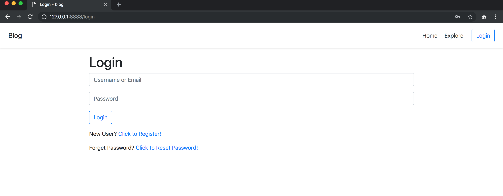
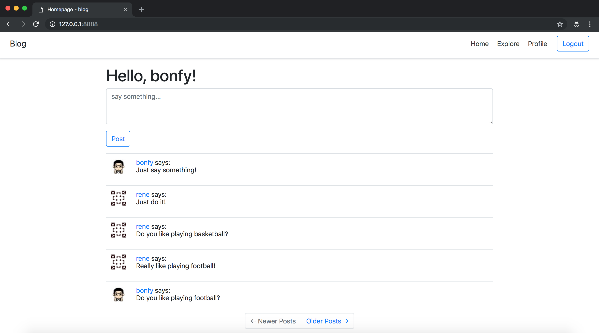
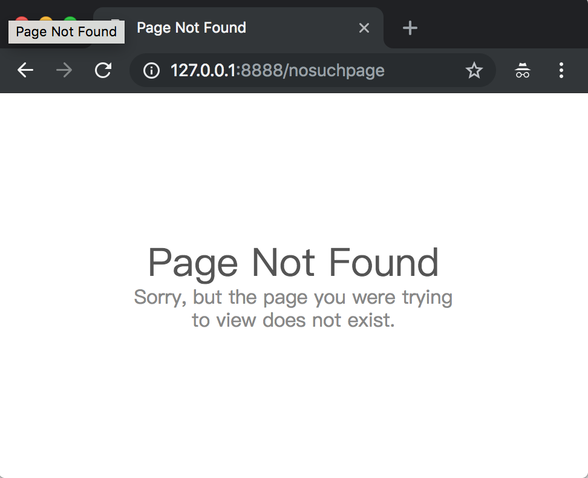

# 11-Facelift

在本章中，我暂停一下后端的工作，并花点时间向你展示如何使应用看起来更加优雅和专业。

本章主要是用到了 前端的 Bootstrap

_本章的GitHub链接为：_ [Source](https://github.com/bonfy/go-mega-code/tree/11-Facelift), [Diff](https://github.com/bonfy/go-mega-code/compare/10-Email-Support...11-Facelift), [Zip](https://github.com/bonfy/go-mega-code/archive/v1.1.zip)

## CSS 框架

虽然我们可以争辩说写代码不容易，但是与那些必须让网页在所有Web浏览器上具有良好一致外观的网页设计师相比，我们的痛苦不值一提。 虽然近年来这种情况得到一定程度的缓解，但是在一些浏览器中仍然存在着晦涩的错误或奇怪的设定，这使得设计网页的任务变得非常困难。 如果还需要兼容屏幕限制设备（诸如平板电脑和智能手机）的浏览器，则更加困难。

如果你和我一样，只是一个想创建出规范网页的开发人员，没有时间或兴趣去学习底层机制并通过编写原生HTML和CSS来实现它，那么唯一可行的解决方案是使用CSS框架来简化任务。 通过这种方式，你会失去一些创造性的自由，但另一方面，无需通过太多的功夫就可以让网页在所有浏览器中看起来都不错。 CSS框架为普通类型的用户界面元素提供了高级CSS类的集合，其中包含预定义样式。 大多数这样的框架还提供JavaScript插件，以实现不能纯粹使用HTML和CSS来完成的功能。


## Bootstrap简介

最受欢迎的CSS框架之一是由Twitter推出的[Bootstrap](http://getbootstrap.com/)。 如果你想看看这个框架可以设计的页面类型，文档有一些[示例](https://getbootstrap.com/docs/4.1/examples/)。

这些是使用Bootstrap来设置网页风格的一些好处：

*   在所有主流网页浏览器中都有相似的外观
*   自动处理PC桌面，平板电脑和手机屏幕尺寸
*   可定制的布局
*   精心设计的导航栏，表单，按钮，警示，弹出窗口等


## Bootstrap美化

由于我们所有的页面都是继承自 `templates/_base.html`，所以我们需要在 \_base.html 中引入 bootstrap 

templates/\_base.html
```html
<html>
    <head>
        {{if .Title}}
        <title>{{.Title}} - blog</title>
        {{else}}
        <title>Welcome to blog!</title>
        {{end}}

        <link rel="stylesheet" href="https://stackpath.bootstrapcdn.com/bootstrap/4.1.3/css/bootstrap.min.css" integrity="sha384-MCw98/SFnGE8fJT3GXwEOngsV7Zt27NXFoaoApmYm81iuXoPkFOJwJ8ERdknLPMO" crossorigin="anonymous">

        <style>
            .container {
                max-width: 960px;
            }
        </style>

    </head>
    <body>
        <div class="d-flex flex-column flex-md-row align-items-center p-3 px-md-4 mb-3 bg-white border-bottom shadow-sm">
            <h5 class="my-0 mr-md-auto font-weight-normal">Blog</h5>
            <nav class="my-2 my-md-0 mr-md-3">
                <a class="p-2 text-dark" href="/">Home</a>
                <a class="p-2 text-dark" href="/explore">Explore</a>
                {{if .CurrentUser}}
                    <a class="p-2 text-dark" href="/user/{{.CurrentUser}}">Profile</a>
                {{end}}
            </nav>

            {{if .CurrentUser}}
                <a class="btn btn-outline-primary" href="/logout">Logout</a>
            {{else}}
                <a class="btn btn-outline-primary" href="/login">Login</a>
            {{end}}
        </div>

        <div class="container">
            {{template "content" .}}
        </div>

        <script src="https://code.jquery.com/jquery-3.3.1.min.js" crossorigin="anonymous"></script>
    </body>
</html>
```

接着我们主要优化的是表单和按钮

* 所有表单上加上 `class="form-control"`
* 所有按钮上加上 `class="btn btn-outline-primary"`
* 所有的分页按钮优化

```html
    <nav aria-label="...">
        <ul class="pagination justify-content-center">
        {{ if gt .PrevPage 0 }}
            <li class="page-item">
                <a href="/user/{{.ProfileUser.Username}}?page={{.PrevPage}}">
                    <span class="page-link" aria-hidden="true">&larr; Newer Posts</span>
                </a>
            </li>
        {{ else }}
            <li class="page-item disabled">
                <a href="#">
                    <span class="page-link" aria-hidden="true">&larr; Newer Posts</span>
                </a>
            </li> 
        {{ end }}
        {{ if gt .NextPage 0 }}
            <li class="page-item">
                <a href="/user/{{.ProfileUser.Username}}?page={{.NextPage}}">
                    <span class="page-link" aria-hidden="true">Older Posts &rarr;</span>
                </a>
            </li>
        {{ else }}
            <li class="page-item disabled">
                <a href="#">
                    <span class="page-link" aria-hidden="true">Older Posts &rarr;</span>
                </a>
            </li> 
        {{ end }}

        </ul>
    </nav>
```





> 本小节 [Diff](https://github.com/bonfy/go-mega-code/commit/ca5ccbaa06d9d4041357979246ed92c031ea722e)

## 自定义 404 界面

我们现在的404界面还是 `gorilla/mux` 的默认界面，现在我们美化下 

vm/notfound.go
```go
package vm

// NotFoundMessage struct
type NotFoundMessage struct {
	Flash string
}
```

templates/404.html
```html
<!doctype html>
<html lang="en">
    <head>
        <meta charset="utf-8">
        <title>Page Not Found</title>
        <meta name="viewport" content="width=device-width, initial-scale=1">
        <style>
            * {
                line-height: 1.2;
                margin: 0;
            }
            html {
                color: #888;
                display: table;
                font-family: sans-serif;
                height: 100%;
                text-align: center;
                width: 100%;
            }
            body {
                display: table-cell;
                vertical-align: middle;
                margin: 2em auto;
            }
            h1 {
                color: #555;
                font-size: 2em;
                font-weight: 400;
            }
            p {
                margin: 0 auto;
                width: 280px;
            }
            @media only screen and (max-width: 280px) {
                body, p {
                    width: 95%;
                }
                h1 {
                    font-size: 1.5em;
                    margin: 0 0 0.3em;
                }
            }
        </style>
    </head>
    <body>
        {{if .Flash}}
        <h1>{{.Flash}}</h1>
        {{else}}
        <h1>Page Not Found</h1>
        {{end}}
        <p>Sorry, but the page you were trying to view does not exist.</p>
    </body>
</html>
```

controller/home.go
```go
...
r.NotFoundHandler = http.HandlerFunc(notfoundHandler)
r.HandleFunc("/404", notfoundHandler)
...


func notfoundHandler(w http.ResponseWriter, r *http.Request) {
	flash := getFlash(w, r)
	message := vm.NotFoundMessage{Flash: flash}
	tpl, _ := template.ParseFiles("templates/404.html")
	tpl.Execute(w, &message)
}
...
```

运行程序，在浏览器中输入一个没有指定的 url，例如: `http://127.0.0.1:8888/nosuchpage`



> 本小节 [Diff](https://github.com/bonfy/go-mega-code/commit/f90f32b1233c1e76dfbdba1c89649fbdd05d46cb)

## Links

  * [目录](README.md)
  * 上一节: [10-Email-Support](10-email-support.md)
  * 下一节: [12-Dates-And-Times](12-dates-and-times.md)